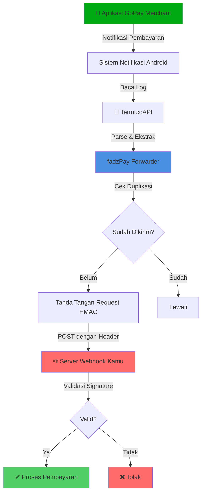

<div align="center">


# 💳 fadzPay

### *Forwarder Otomatis Notifikasi Pembayaran GoPay Merchant*

**fadzPay** adalah forwarder notifikasi pembayaran GoPay Merchant yang berjalan di Android (Termux). Sistem ini membaca notification log melalui Termux:API dan secara otomatis mengirim event pembayaran ke endpoint server kamu sebagai webhook.

*Ideal untuk HP dedicated (always-on) agar status pembayaran bisa diproses otomatis tanpa campur tangan manual.*

[](https://github.com/yourusername/fadzpay)
[](https://www.android.com/)
[](https://termux.com/)
[](https://opensource.org/licenses/MIT)

</div>

---

## 🏗️ Arsitektur

### Diagram Alur Sistem



### Cara Kerjanya

Bayangkan fadzPay seperti **tukang pos pintar** 📬 untuk notifikasi pembayaran kamu:

1. **👀 Pengamat** — fadzPay terus memantau notifikasi GoPay Merchant kamu, seperti satpam yang cek CCTV
2. **🧠 Otak** — Ketika ada pembayaran masuk, dia baca notifikasi dan ekstrak info penting (jumlah, order ID, timestamp)
3. **🔐 Brankas** — Sebelum kirim, data ditandatangani dengan HMAC (kayak kasih segel anti-rusak di amplop)
4. **📮 Pengiriman** — Kirim data pembayaran yang sudah ditandatangani ke server kamu via webhook
5. **🛡️ Penjaga** — Server kamu cek segel (HMAC signature) buat mastiin asli
6. **🎯 Aksi** — Kalau semua oke, server kamu otomatis proses pembayarannya!

**Analogi Kehidupan Nyata:**
> Bayangin kamu punya toko online. Daripada manual cek HP tiap ada customer bayar via GoPay, fadzPay bertindak sebagai **asisten virtual** yang langsung kasih tau sistem toko kamu: *"Bos, ada yang baru bayar Rp 50.000 untuk Order #12345!"* — dan sistem kamu otomatis tandain ordernya sebagai lunas. 🎉

---

## ✨ Fitur Utama

<div align="center">

| Fitur | Deskripsi | Manfaat |
|-------|-----------|---------|
| 📱 **Monitoring Notifikasi** | Scan notifikasi GoPay Merchant | Deteksi pembayaran real-time |
| 🔒 **Keamanan Utama** | HMAC signing + PIN header | Cegah manipulasi & akses tidak sah |
| 🚫 **Anti Duplikasi** | Filter event pintar | Gak ada webhook dobel |
| 💪 **Tangguh** | Jalan di sesi tmux | Tahan putus koneksi |
| 🔄 **Auto-Recovery** | Watchdog restart otomatis | Uptime 99.9% |
| 🚀 **Auto-Start** | Boot bareng Termux:Boot | Nol intervensi manual |
| 🧹 **Install Pintar** | Deteksi & bersihin install lama | Fresh start setiap kali |

</div>

---

## 📋 Kebutuhan

### Aplikasi (Install via F-Droid)

- [Termux](https://f-droid.org/packages/com.termux/)
- [Termux:API](https://f-droid.org/packages/com.termux.api/)
- [Termux:Boot](https://f-droid.org/packages/com.termux.boot/) — untuk auto-start

### Izin yang Diperlukan

Aktifkan izin berikut di Android:

1. **Akses Notifikasi untuk Termux:API**
   ```
   Settings → Apps → Special access → Notification access → Aktifkan Termux:API
   ```

2. **Optimasi Baterai (Disarankan)**
   
   Set ke "Unrestricted" untuk aplikasi berikut:
   - Termux
   - Termux:API
   - GoPay Merchant
   
   Lokasi: `Settings → Apps → Battery → Unrestricted`

---

## 🚀 Instalasi

### Mulai Cepat

<div align="center">

```bash
# 1️⃣ Download & jadikan executable
chmod +x install_fadzpay.sh

# 2️⃣ Jalankan installer
./install_fadzpay.sh

# 3️⃣ Ikuti prompt dan selesai! 🎉
```

</div>

---

### Mode Interaktif (Disarankan)

```bash
chmod +x install_fadzpay.sh
./install_fadzpay.sh
```

Ikuti prompt untuk mengisi konfigurasi:

<div align="center">

| Variabel | Deskripsi | Contoh |
|----------|-----------|--------|
| `API_BASE_URL` | Endpoint webhook server kamu | `https://wb.domainkamu.id` |
| `TOKEN` | Token autentikasi | `your-secret-token-here` |
| `SECRET` | Secret key untuk HMAC signing | `your-hmac-secret-key` |
| `PIN` | PIN tambahan untuk header request | `1234` |
| `INTERVAL_SEC` | Interval polling notifikasi (detik) | `5` |
| `MIN_AMOUNT` | Jumlah minimum untuk diforward | `1000` |
| `WATCHDOG_INTERVAL` | Interval cek watchdog (detik) | `30` |

</div>

### Mode Non-Interaktif

Untuk automation atau instalasi tanpa interaksi:

```bash
AUTO_YES=1 ./install_fadzpay.sh
```

> **💡 Tips Pro**: Mode ini akan pakai nilai default untuk semua konfigurasi.

---

## 🎮 Perintah

<div align="center">

### Kontrol Instance fadzPay Kamu

</div>

Semua perintah dijalankan melalui control script di `~/fadzpay/bin/forwarderctl.sh`:

---

### 📊 Cek Status

```bash
~/fadzpay/bin/forwarderctl.sh status
```

**Fungsinya:** Menampilkan status forwarder dan watchdog service
```
✅ fadzpay-forwarder sedang berjalan (PID: 12345)
✅ fadzpay-watchdog sedang berjalan (PID: 12346)
```

---

### 👀 Masuk ke Sesi

```bash
~/fadzpay/bin/forwarderctl.sh attach
```

**Fungsinya:** Lihat output real-time dari forwarder

> **💡 Tips:** Tekan `Ctrl+B` lalu `D` untuk keluar tanpa stop service

---

### 🔄 Restart Service

```bash
~/fadzpay/bin/forwarderctl.sh restart
```

**Fungsinya:** Stop dan start ulang forwarder beserta watchdog

**Kapan dipakai:** Setelah update config atau troubleshooting

---

### ⏹️ Stop Service

```bash
~/fadzpay/bin/forwarderctl.sh stop
```

**Fungsinya:** Hentikan forwarder dan watchdog

**Peringatan:** Service gak akan auto-restart sampai kamu start lagi!

---

### ▶️ Start Service

```bash
~/fadzpay/bin/forwarderctl.sh start
```

**Fungsinya:** Jalankan forwarder dan watchdog

**Catatan:** Otomatis dipanggil saat install

---

## 📊 Log

Monitor aktivitas fadzPay melalui file log:

### Log Forwarder
```bash
tail -f ~/fadzpay/logs/fadzpay-forwarder.log
```

### Log Watchdog
```bash
tail -f ~/fadzpay/logs/fadzpay-watchdog.log
```

### Lihat Semua Log
```bash
ls -lh ~/fadzpay/logs/
```

---

## 🗑️ Uninstall

Untuk menghapus fadzPay sepenuhnya dari sistem:

```bash
chmod +x uninstall_fadzpay.sh
./uninstall_fadzpay.sh
```

Script ini akan:
- Stop semua service yang berjalan
- Hapus tmux sessions
- Bersihkan crontab entries
- Hapus direktori instalasi

---

## 🔐 Catatan Keamanan

### Best Practice

- ⚠️ **Jangan pernah share** kredensial `TOKEN`, `SECRET`, dan `PIN` ke siapapun
- 🔒 **Gunakan HTTPS** untuk endpoint server kamu
- 🛡️ **Validasi signature** di sisi server untuk verifikasi keaslian request
- ⏱️ **Implementasi cek timestamp** di server untuk cegah replay attack
- 🔑 **Rotate credentials** secara berkala untuk keamanan maksimal
- 📱 **Isolasi device** — gunakan HP khusus yang tidak dipakai untuk aktivitas pribadi

### Verifikasi di Sisi Server

Pastikan endpoint server kamu melakukan:

1. Verifikasi HMAC signature di header request
2. Cek timestamp untuk cegah replay attack (max 5 menit)
3. Validasi PIN header
4. Rate limiting untuk cegah penyalahgunaan

---

## 🔧 Troubleshooting

### Forwarder tidak jalan setelah reboot

Pastikan Termux:Boot sudah diinstall dan dibuka minimal 1x setelah instalasi.

### Notifikasi tidak terdeteksi

1. Cek izin Akses Notifikasi untuk Termux:API
2. Pastikan GoPay Merchant terinstall dan aktif
3. Cek log untuk pesan error

### Watchdog tidak auto-restart

Verifikasi crontab entry:
```bash
crontab -l | grep watchdog
```

### Request tidak sampai ke server

1. Test koneksi: `curl -I https://endpoint-kamu.com`
2. Cek log untuk HTTP error codes
3. Verifikasi `API_BASE_URL` di config

---

## 📝 Changelog

Lihat file `CHANGELOG.md` untuk riwayat perubahan versi.

---

## 🤝 Kontribusi

Kontribusi sangat diterima! Silakan buat issue atau pull request untuk:

- Perbaikan bug
- Request fitur baru
- Peningkatan dokumentasi
- Optimasi performa

---

## 📄 Lisensi

Project ini menggunakan lisensi MIT. Lihat file `LICENSE` untuk detail lengkap.

---

## ⚠️ Disclaimer

**fadzPay** adalah project independen dan **tidak berafiliasi** dengan Gojek, GoPay, atau entitas terkait lainnya. 

- Gunakan software ini atas risiko kamu sendiri
- Developer tidak bertanggung jawab atas kerugian atau masalah yang timbul dari penggunaan software ini
- Pastikan penggunaan sesuai dengan Terms of Service GoPay Merchant
- Hormati privacy dan data user dalam implementasi kamu

---

## 💬 Support

Jika menemukan masalah atau punya pertanyaan:

1. Cek bagian Troubleshooting terlebih dahulu
2. Baca log untuk pesan error
3. Buat issue di repository dengan detail lengkap:
   - Versi Android
   - Versi Termux
   - Pesan error dari log
   - Langkah untuk reproduce masalah

---

<div align="center">

**Dibuat dengan ❤️ untuk proses pembayaran yang seamless**

*Happy coding! 🚀*

</div>