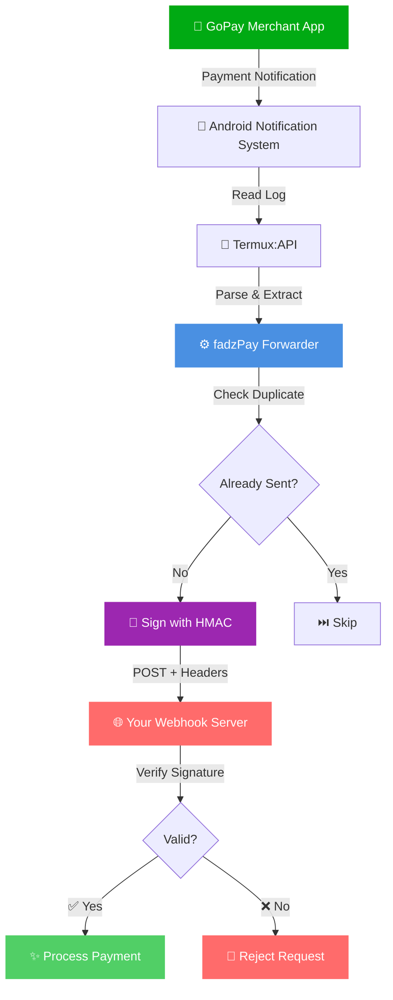

<div align="center">


# 💎 fadzPay

<p align="center">
  <b>Forwarder Otomatis Notifikasi Pembayaran GoPay Merchant</b>
</p>

<p align="center">
  <i>Sistem webhook pintar yang mengubah notifikasi pembayaran GoPay menjadi event API otomatis</i>
</p>

<p align="center">
  <a href="#-instalasi-cepat"></a>
  <a href="#-dokumentasi"></a>
  <a href="#-lisensi"></a>
</p>

<p align="center">
  
  
  
  
</p>

---

### 🎯 Kenapa fadzPay?

<table>
<tr>
<td width="50%">

**🚀 Otomasi Penuh**
- Zero manual checking
- Real-time notification forwarding
- Auto-restart & recovery

</td>
<td width="50%">

**🔒 Keamanan Enterprise**
- HMAC signature verification
- PIN-based authentication
- Anti-replay protection

</td>
</tr>
<tr>
<td width="50%">

**💪 Reliable & Robust**
- Watchdog monitoring
- Deduplication system
- Persistent across reboots

</td>
<td width="50%">

**⚡ Setup Super Cepat**
- One-liner installation
- Interactive config
- Pre-configured defaults

</td>
</tr>
</table>

</div>

---

## 📖 Daftar Isi

- [🎬 Instalasi Cepat](#-instalasi-cepat)
- [🏗️ Arsitektur Sistem](#️-arsitektur-sistem)
- [✨ Fitur Unggulan](#-fitur-unggulan)
- [📋 Kebutuhan](#-kebutuhan)
- [🛠️ Instalasi Detail](#️-instalasi-detail)
- [🎮 Command Reference](#-command-reference)
- [📊 Monitoring & Logs](#-monitoring--logs)
- [🔐 Keamanan](#-keamanan)
- [🔧 Troubleshooting](#-troubleshooting)
- [🤝 Kontribusi](#-kontribusi)

---

## 🎬 Instalasi Cepat

<div align="center">

### 🚀 One-Liner Commands

<table>
<tr>
<th width="30%">Action</th>
<th width="70%">Command</th>
</tr>

<tr>
<td align="center">
<b>📦 Install fadzPay</b><br/>
<i>Standard Version</i>
</td>
<td>

```bash
pkg update && pkg upgrade -y && pkg install -y curl && \
bash <(curl -sSL https://raw.githubusercontent.com/Matsumiko/fadzPay/main/install_fadzpay.sh)
```

</td>
</tr>

<tr>
<td align="center">
<b>💓 Install fadzPay HeartBeat</b><br/>
<i>Monitoring</i>
</td>
<td>

```bash
bash <(curl -sSL https://raw.githubusercontent.com/Matsumiko/fadzPay/main/install_fadzpay_heartbeat.sh)
```

</td>
</tr>

<tr>
<td align="center">
<b>🗑️ Uninstall fadzPay</b><br/>
<i>Clean Removal</i>
</td>
<td>

```bash
bash <(curl -sSL https://raw.githubusercontent.com/Matsumiko/fadzPay/main/uninstall_fadzpay.sh)
```

</td>
</tr>

</table>

> **💡 Pro Tip:** Copy-paste command di atas langsung ke Termux, duduk santai, dan biarkan installer bekerja!

</div>

---

## 🏗️ Arsitektur Sistem

### 📐 Diagram Alur



### 🎯 Cara Kerja (Simplified)

<div align="center">

```
┌─────────────────────────────────────────────────────────────┐
│  📱 Notifikasi Masuk → 👀 Detect → 🧠 Parse → 🔐 Sign      │
│                                                             │
│  → 📮 Kirim ke Server → 🛡️ Verify → ✅ Process → 🎉 Done!  │
└─────────────────────────────────────────────────────────────┘
```

</div>

#### 🔄 Flow Step-by-Step

1. **📱 Detection Phase**
   - GoPay Merchant mengeluarkan notifikasi pembayaran
   - Android notification system mencatat ke log
   - Termux:API membaca notification log

2. **🧠 Processing Phase**
   - fadzPay parsing notifikasi untuk extract data
   - Validasi jumlah minimum (configurable)
   - Check duplikasi dari cache lokal

3. **🔐 Security Phase**
   - Generate HMAC signature dengan SECRET key
   - Attach PIN ke request header
   - Add timestamp untuk anti-replay

4. **📮 Delivery Phase**
   - POST data ke webhook endpoint kamu
   - Server verify signature & PIN
   - Response handling & logging

5. **♻️ Recovery Phase**
   - Watchdog monitoring service health
   - Auto-restart jika crash
   - Persistent state across reboots

---

## ✨ Fitur Unggulan

<div align="center">

<table>
<tr>
<td width="33%" align="center">

### 🎯 Smart Detection
**Real-time Monitoring**
- Scan notifikasi setiap N detik
- Filter by minimum amount
- Regex pattern matching

</td>
<td width="33%" align="center">

### 🔒 Security First
**Enterprise-grade Protection**
- HMAC-SHA256 signing
- PIN authentication
- Timestamp validation

</td>
<td width="33%" align="center">

### 💪 Reliability
**99.9% Uptime**
- Watchdog auto-restart
- Deduplication cache
- Crash recovery

</td>
</tr>

<tr>
<td width="33%" align="center">

### 🚀 Zero Config
**Plug & Play**
- Interactive installer
- Auto-detection
- Smart defaults

</td>
<td width="33%" align="center">

### 📊 Observability
**Complete Visibility**
- Detailed logging
- Status monitoring
- Error tracking

</td>
<td width="33%" align="center">

### 🔄 Auto-Start
**Hands-free Operation**
- Boot with Termux:Boot
- Cron-based watchdog
- Session persistence

</td>
</tr>
</table>

</div>

---

## 📋 Kebutuhan

### 📱 Aplikasi Wajib

Semua aplikasi harus diinstall dari **F-Droid** (bukan Google Play):

<div align="center">

| Aplikasi | Link F-Droid | Fungsi |
|----------|--------------|--------|
| **Termux** | [Download](https://f-droid.org/packages/com.termux/) | Terminal emulator utama |
| **Termux:API** | [Download](https://f-droid.org/packages/com.termux.api/) | Bridge ke Android API |
| **Termux:Boot** | [Download](https://f-droid.org/packages/com.termux.boot/) | Auto-start on boot |
| **GoPay Merchant** | Google Play | Source notifikasi payment |

</div>

> ⚠️ **Penting:** Termux dari Google Play tidak compatible! Harus dari F-Droid.

### 🔑 Izin Android

**1. Notification Access untuk Termux:API**

```
Settings → Apps → Special App Access → Notification Access 
→ Enable "Termux:API"
```

**2. Battery Optimization (Recommended)**

Set ke **"Unrestricted"** untuk app berikut:

```
Settings → Apps → Battery → Unrestricted:
✓ Termux
✓ Termux:API  
✓ Termux:Boot
✓ GoPay Merchant
```

**3. Autostart Permission (Untuk beberapa vendor)**

```
Settings → Apps → Autostart
→ Enable untuk Termux, Termux:API, Termux:Boot
```

---

## 🛠️ Instalasi Detail

### 🎨 Mode Interaktif (Recommended)

Installer akan menanyakan konfigurasi satu per satu:

```bash
pkg update && pkg upgrade -y && pkg install -y curl && \
bash <(curl -sSL https://raw.githubusercontent.com/Matsumiko/fadzPay/main/install_fadzpay.sh)
```

**Konfigurasi yang perlu diisi:**

<div align="center">

| Parameter | Deskripsi | Contoh Value | Default |
|-----------|-----------|--------------|---------|
| `API_BASE_URL` | Webhook endpoint server | `https://webhook.domain.com` | - |
| `TOKEN` | Auth token untuk request | `sk_live_abc123xyz` | - |
| `SECRET` | HMAC signing secret | `super-secret-key-2024` | - |
| `PIN` | Additional security PIN | `1234` | - |
| `INTERVAL_SEC` | Polling interval (detik) | `5` | `5` |
| `MIN_AMOUNT` | Minimum amount to forward | `1000` | `1000` |
| `WATCHDOG_INTERVAL` | Health check interval | `30` | `30` |

</div>

### 🤖 Mode Non-Interaktif

Untuk automation atau CI/CD:

```bash
AUTO_YES=1 bash <(curl -sSL https://raw.githubusercontent.com/Matsumiko/fadzPay/main/install_fadzpay.sh)
```

> **⚠️ Catatan:** Mode ini akan menggunakan nilai default. Edit `~/.fadzpay.env` setelah instalasi.

### 💓 HeartBeat Version

Monitoring & health reporting:

```bash
bash <(curl -sSL https://raw.githubusercontent.com/Matsumiko/fadzPay/main/install_fadzpay_heartbeat.sh)
```

**Fitur tambahan HeartBeat:**
- Periodic health ping ke server
- Detailed system metrics
- Remote monitoring capability

---

## 🎮 Command Reference

<div align="center">

### 🕹️ Control fadzPay Instance

Semua command dijalankan via control script:

```bash
~/fadzpay/bin/forwarderctl.sh [command]
```

</div>

---

### 📊 `status` - Cek Status Service

```bash
~/fadzpay/bin/forwarderctl.sh status
```

**Output:**
```
✅ fadzpay-forwarder is running (PID: 12345)
✅ fadzpay-watchdog is running (PID: 12346)
📊 Uptime: 2d 14h 32m
💾 Memory: 45MB
🔄 Last restart: 2024-01-15 10:30:42
```

---

### 👀 `attach` - Monitor Real-time

```bash
~/fadzpay/bin/forwarderctl.sh attach
```

**Fungsi:** Attach ke tmux session untuk lihat output live

**Keluar:** Tekan `Ctrl+B` kemudian `D` (detach tanpa stop)

---

### 🔄 `restart` - Restart Service

```bash
~/fadzpay/bin/forwarderctl.sh restart
```

**Kapan digunakan:**
- Setelah edit config di `~/.fadzpay.env`
- Setelah update/upgrade system
- Troubleshooting performance issues

---

### ⏹️ `stop` - Stop Service

```bash
~/fadzpay/bin/forwarderctl.sh stop
```

**⚠️ Warning:** Service tidak akan auto-start sampai manual start lagi

---

### ▶️ `start` - Start Service

```bash
~/fadzpay/bin/forwarderctl.sh start
```

**Note:** Otomatis dipanggil saat instalasi selesai

---

### 🔧 `logs` - Quick Log Access

```bash
# Lihat forwarder logs
~/fadzpay/bin/forwarderctl.sh logs

# Lihat watchdog logs  
~/fadzpay/bin/forwarderctl.sh logs watchdog
```

---

## 📊 Monitoring & Logs

### 📝 Log Files Location

```
~/fadzpay/logs/
├── fadzpay-forwarder.log    # Main forwarder logs
├── fadzpay-watchdog.log     # Watchdog monitoring logs
└── fadzpay-install.log      # Installation logs
```

### 🔍 Monitoring Commands

<div align="center">

| Command | Fungsi |
|---------|--------|
| `tail -f ~/fadzpay/logs/fadzpay-forwarder.log` | Follow forwarder logs |
| `tail -f ~/fadzpay/logs/fadzpay-watchdog.log` | Follow watchdog logs |
| `tail -n 100 ~/fadzpay/logs/fadzpay-forwarder.log` | Last 100 lines |
| `grep "ERROR" ~/fadzpay/logs/*.log` | Search errors |
| `ls -lh ~/fadzpay/logs/` | List all logs |

</div>

### 📈 Log Interpretation

**✅ Sukses:**
```
[2024-12-15 14:30:42] ✅ Payment detected: Rp 50000 | Order: #ORD123
[2024-12-15 14:30:43] 🔐 HMAC signature generated
[2024-12-15 14:30:44] 📮 Sent to server | Response: 200 OK
```

**⚠️ Warning:**
```
[2024-12-15 14:35:21] ⚠️  Duplicate detected, skipping...
[2024-12-15 14:40:12] ⚠️  Retry attempt 2/3
```

**❌ Error:**
```
[2024-12-15 14:45:33] ❌ Connection failed: timeout
[2024-12-15 14:45:34] 🔄 Watchdog restarting service...
```

---

## 🔐 Keamanan

### 🛡️ Security Features

<table>
<tr>
<td width="50%">

**🔐 HMAC Signature**
- Algorithm: HMAC-SHA256
- Input: timestamp + payload
- Key: SECRET dari config
- Header: `X-Signature`

</td>
<td width="50%">

**🔑 PIN Authentication**
- Custom PIN per installation
- Sent via: `X-Pin` header
- Validation: server-side
- Prevents: unauthorized access

</td>
</tr>
<tr>
<td width="50%">

**⏱️ Timestamp Protection**
- Unix timestamp in payload
- Max age: 300s (5 minutes)
- Prevents: replay attacks
- Format: `X-Timestamp` header

</td>
<td width="50%">

**🔒 Token-based Auth**
- Bearer token authentication
- Sent via: `Authorization` header
- Rotation: recommended monthly
- Storage: `.fadzpay.env`

</td>
</tr>
</table>

### ✅ Best Practices

#### 🔐 Credential Management

```bash
# ❌ Jangan:
- Share credentials via chat/email
- Commit .fadzpay.env ke git
- Gunakan weak passwords
- Skip server-side validation

# ✅ Lakukan:
- Rotate credentials monthly
- Use strong random secrets
- Store in secure location
- Implement rate limiting
```

#### 🌐 Server-Side Validation

**Sample validation logic:**

```javascript
// Pseudo-code untuk server validation
function validateRequest(req) {
  // 1. Check PIN
  if (req.headers['x-pin'] !== EXPECTED_PIN) {
    return reject('Invalid PIN');
  }
  
  // 2. Check timestamp (max 5 minutes old)
  const timestamp = req.headers['x-timestamp'];
  if (Date.now() - timestamp > 300000) {
    return reject('Request expired');
  }
  
  // 3. Verify HMAC signature
  const payload = timestamp + JSON.stringify(req.body);
  const expectedSig = hmacSHA256(payload, SECRET);
  if (req.headers['x-signature'] !== expectedSig) {
    return reject('Invalid signature');
  }
  
  return accept();
}
```

#### 🔒 Device Security

- 📱 Gunakan device dedicated (tidak untuk personal use)
- 🔐 Set screen lock pada device
- 🚫 Disable USB debugging saat production
- 📡 Gunakan koneksi internet yang secure
- 🔄 Update Termux & packages secara regular

---

## 🔧 Troubleshooting

### ❓ Common Issues & Solutions

<details>
<summary><b>🔴 Forwarder tidak jalan setelah reboot</b></summary>

**Penyebab:**
- Termux:Boot belum dijalankan pertama kali
- Auto-start script tidak terpasang

**Solusi:**
```bash
# 1. Buka Termux:Boot app minimal 1x
# 2. Verifikasi boot script exists
ls -la ~/.termux/boot/

# 3. Test manual start
~/fadzpay/bin/forwarderctl.sh start

# 4. Check crontab
crontab -l | grep fadzpay
```

</details>

<details>
<summary><b>🔴 Notifikasi tidak terdeteksi</b></summary>

**Checklist:**
1. ✅ Termux:API memiliki Notification Access
2. ✅ GoPay Merchant terinstall & aktif
3. ✅ Test notifikasi manual dari GoPay
4. ✅ Check log untuk errors

**Debug:**
```bash
# Test notification API
termux-notification-list

# Should return GoPay notifications
# If empty, izin notification belum di-grant
```

</details>

<details>
<summary><b>🔴 Request gagal sampai server</b></summary>

**Diagnosis:**
```bash
# 1. Test connectivity
curl -I https://your-webhook-endpoint.com

# 2. Check logs untuk HTTP errors
tail -n 50 ~/fadzpay/logs/fadzpay-forwarder.log | grep "HTTP"

# 3. Verify config
cat ~/.fadzpay.env | grep API_BASE_URL
```

**Common Issues:**
- ❌ Wrong URL format (missing https://)
- ❌ Firewall blocking requests
- ❌ Server down / maintenance
- ❌ Invalid SSL certificate

</details>

<details>
<summary><b>🔴 Watchdog tidak auto-restart</b></summary>

**Verifikasi:**
```bash
# Check crontab
crontab -l

# Should show:
# */1 * * * * ~/fadzpay/bin/watchdog.sh

# Test manual watchdog
~/fadzpay/bin/watchdog.sh

# Check watchdog logs
tail -f ~/fadzpay/logs/fadzpay-watchdog.log
```

</details>

<details>
<summary><b>🔴 Duplicate notifications</b></summary>

**Info:** Ini adalah behavior normal untuk protection

**Jika terlalu banyak skip:**
```bash
# Clear notification cache
rm -f ~/fadzpay/data/sent_notifications.cache

# Restart service
~/fadzpay/bin/forwarderctl.sh restart
```

</details>

<details>
<summary><b>🔴 High memory usage</b></summary>

**Solusi:**
```bash
# 1. Restart service
~/fadzpay/bin/forwarderctl.sh restart

# 2. Clear old logs
find ~/fadzpay/logs -name "*.log" -mtime +7 -delete

# 3. Optimize polling interval
# Edit ~/.fadzpay.env
# Set INTERVAL_SEC=10 (instead of 5)
```

</details>

### 🆘 Get Help

Jika masalah persist:

1. 📖 Baca dokumentasi lengkap
2. 🔍 Search di Issues (mungkin sudah ada solusi)
3. 🐛 Buat Issue baru dengan info:
   - Android version
   - Termux version
   - Error messages dari log
   - Steps to reproduce

---

## 🗑️ Uninstall

### 🧹 Clean Removal

```bash
bash <(curl -sSL https://raw.githubusercontent.com/Matsumiko/fadzPay/main/uninstall_fadzpay.sh)
```

**Yang akan dihapus:**
- ✅ Stop semua running services
- ✅ Kill tmux sessions
- ✅ Remove crontab entries
- ✅ Delete installation directory (`~/fadzpay`)
- ✅ Remove environment config (`~/.fadzpay.env`)
- ✅ Clean boot scripts (`~/.termux/boot/`)

**Yang TIDAK dihapus:**
- ❌ Termux packages (jq, curl, tmux, etc)
- ❌ Termux apps (API, Boot)
- ❌ System logs

> 💡 **Reinstall:** Jalankan install script lagi kapanpun

---

## 🤝 Kontribusi

<div align="center">

### 💝 Kontribusi Diterima!

Kami welcome semua bentuk kontribusi untuk membuat fadzPay lebih baik

</div>

### 🎯 Area Kontribusi

<table>
<tr>
<td width="50%">

**🐛 Bug Fixes**
- Report bugs via Issues
- Submit fix dengan Pull Request
- Include test cases
- Update documentation

**✨ Feature Requests**
- Diskusi di Issues dulu
- Provide use cases
- Consider backward compatibility
- Update README if needed

</td>
<td width="50%">

**📚 Documentation**
- Improve clarity
- Add examples
- Translate to other languages
- Fix typos & grammar

**⚡ Performance**
- Optimize code
- Reduce resource usage
- Improve startup time
- Better error handling

</td>
</tr>
</table>

### 📝 Contribution Guidelines

1. **Fork** repository
2. **Create branch** (`git checkout -b feature/AmazingFeature`)
3. **Commit** changes (`git commit -m 'Add some AmazingFeature'`)
4. **Push** to branch (`git push origin feature/AmazingFeature`)
5. **Open Pull Request**

---

## 📄 Lisensi

<div align="center">

**MIT License**

Project ini open-source dan gratis untuk digunakan.

Lihat [LICENSE](LICENSE) untuk detail lengkap.

</div>

---

## ⚠️ Disclaimer

<div align="center">

> **fadzPay** adalah independent project dan **TIDAK berafiliasi** dengan Gojek, GoPay, atau entitas terkait.

</div>

### 📋 Terms of Use

- ✅ Gunakan sesuai dengan TOS GoPay Merchant
- ✅ Lindungi data & privacy user
- ✅ Implement proper security measures
- ⚠️ Gunakan atas risiko sendiri
- ❌ Developer tidak bertanggung jawab atas kerugian
- ❌ No warranty provided (see LICENSE)

### 🔒 Privacy & Data

fadzPay hanya:
- ✅ Membaca notification log lokal
- ✅ Forward data ke endpoint yang KAMU tentukan
- ✅ Store cache lokal untuk deduplication

fadzPay TIDAK:
- ❌ Kirim data ke third-party
- ❌ Collect analytics
- ❌ Store payment data permanently
- ❌ Access sensitive GoPay data

---

## 💬 Support & Community

<div align="center">

### 🆘 Butuh Bantuan?

<table>
<tr>
<td align="center" width="33%">

**📖 Documentation**

Baca docs lengkap di README ini

</td>
<td align="center" width="33%">

**🐛 Issues**

[Report bugs](../../issues) atau request features

</td>
<td align="center" width="33%">

**💬 Discussions**

[Join discussion](../../discussions) dengan community

</td>
</tr>
</table>

### 📊 Project Stats


</div>

---

<div align="center">

## 🌟 Star History

[](https://star-history.com/#Matsumiko/fadzPay&Date)

---

<br/>

**Dibuat dengan ❤️ dan ☕ untuk seamless payment automation**

<br/>

```ascii
╔═══════════════════════════════════════════════════════════╗
║                                                           ║
║   "Automation is not about replacing humans,              ║
║    it's about empowering them to do more."                ║
║                                                           ║
╚═══════════════════════════════════════════════════════════╝
```

<br/>

*Happy coding & happy automating! 🚀*

<br/>

**[⬆ Back to Top](#-fadzpay)**

</div>
