<div align="center">


# 💳 fadzPay

### *Automated GoPay Merchant Payment Forwarder*

**fadzPay** adalah forwarder notifikasi pembayaran GoPay Merchant yang berjalan di Android (Termux). Sistem ini membaca notification log melalui Termux:API dan secara otomatis mengirim event pembayaran ke endpoint server kamu sebagai webhook.

*Ideal untuk HP dedicated (always-on) agar status pembayaran bisa diproses otomatis tanpa campur tangan manual.*

[](https://github.com/yourusername/fadzpay)
[](https://www.android.com/)
[](https://termux.com/)
[](https://opensource.org/licenses/MIT)

</div>

---

## 🏗️ Architecture

### System Flow Diagram

```mermaid
graph TD
    A[📱 GoPay Merchant App] -->|Payment Notification| B[Android Notification System]
    B -->|Read Logs| C[🤖 Termux:API]
    C -->|Parse & Extract| D[fadzPay Forwarder]
    D -->|Dedup Check| E{Already Sent?}
    E -->|No| F[Sign Request HMAC]
    E -->|Yes| G[Skip]
    F -->|POST with Headers| H[🌐 Your Webhook Server]
    H -->|Validate Signature| I{Valid?}
    I -->|Yes| J[✅ Process Payment]
    I -->|No| K[❌ Reject]
    
    style A fill:#00AA13
    style D fill:#4A90E2
    style H fill:#FF6B6B
    style J fill:#51CF66
    style K fill:#FF6B6B
```



### How It Works

Think of fadzPay like a **smart mailman** 📬 for your payment notifications:

1. **👀 The Watcher** — fadzPay constantly monitors your GoPay Merchant notifications, like a security guard checking CCTV
2. **🧠 The Brain** — When a payment comes in, it reads the notification and extracts important info (amount, order ID, timestamp)
3. **🔐 The Vault** — Before sending, it signs the data with HMAC (like putting a tamper-proof seal on an envelope)
4. **📮 The Delivery** — Sends the signed payment data to your server via webhook
5. **🛡️ The Guardian** — Your server checks the seal (HMAC signature) to make sure it's legit
6. **🎯 The Action** — If everything checks out, your server processes the payment automatically!

**Real-World Analogy:**
> Imagine you run an online store. Instead of manually checking your phone every time a customer pays via GoPay, fadzPay acts as your **virtual assistant** that instantly notifies your store system: *"Hey boss, someone just paid Rp 50,000 for Order #12345!"* — and your system automatically marks the order as paid. 🎉

---

- **📱 Notification Monitoring** — Scan notifikasi dari GoPay Merchant (`com.gojek.gopaymerchant`)
- **🔒 Security-First** — Request signing dengan HMAC + PIN header untuk keamanan tambahan
- **🚫 Deduplication** — Hindari pengiriman event duplikat
- **💪 Resilient** — Berjalan dalam tmux session untuk stabilitas maksimal
- **🔄 Auto-Recovery** — Watchdog service otomatis restart jika forwarder mati
- **🚀 Auto-Start** — Jalan otomatis saat reboot menggunakan Termux:Boot
- **🧹 Smart Install** — Deteksi instalasi lama dan bersihkan sebelum install ulang

---

## 📋 Requirements

### Aplikasi (Install via F-Droid)

- [Termux](https://f-droid.org/packages/com.termux/)
- [Termux:API](https://f-droid.org/packages/com.termux.api/)
- [Termux:Boot](https://f-droid.org/packages/com.termux.boot/) — untuk auto-start

### Permissions

Aktifkan izin berikut di Android:

1. **Notification Access untuk Termux:API**
   ```
   Settings → Apps → Special access → Notification access → Enable Termux:API
   ```

2. **Battery Optimization (Recommended)**
   
   Set ke "Unrestricted" untuk aplikasi berikut:
   - Termux
   - Termux:API
   - GoPay Merchant
   
   Lokasi: `Settings → Apps → Battery → Unrestricted`

---

## 🚀 Instalasi

### Quick Start

<div align="center">

```bash
# 1️⃣ Download & make executable
chmod +x install_fadzpay.sh

# 2️⃣ Run installer
./install_fadzpay.sh

# 3️⃣ Follow the prompts and you're done! 🎉
```

</div>

---

### Interactive Mode (Recommended)

```bash
chmod +x install_fadzpay.sh
./install_fadzpay.sh
```

Ikuti prompt untuk mengisi konfigurasi:

<div align="center">

| Variable | Deskripsi | Contoh |
|----------|-----------|--------|
| `API_BASE_URL` | Endpoint webhook server kamu | `https://wb.domainkamu.id` |
| `TOKEN` | Token autentikasi | `your-secret-token-here` |
| `SECRET` | Secret key untuk HMAC signing | `your-hmac-secret-key` |
| `PIN` | PIN tambahan untuk header request | `1234` |
| `INTERVAL_SEC` | Interval polling notifikasi (detik) | `5` |
| `MIN_AMOUNT` | Minimum amount untuk diforward | `1000` |
| `WATCHDOG_INTERVAL` | Interval check watchdog (detik) | `30` |

</div>

### Non-Interactive Mode

Untuk automation atau instalasi tanpa interaksi:

```bash
AUTO_YES=1 ./install_fadzpay.sh
```

> **💡 Pro Tip**: Mode ini akan menggunakan nilai default untuk semua konfigurasi.

---

## 🎮 Commands

<div align="center">

### Control Your fadzPay Instance

</div>

Semua command dijalankan melalui control script di `~/fadzpay/bin/forwarderctl.sh`:

---

### 📊 Status Check

```bash
~/fadzpay/bin/forwarderctl.sh status
```

**What it does:** Menampilkan status forwarder dan watchdog service
```
✅ fadzpay-forwarder is running (PID: 12345)
✅ fadzpay-watchdog is running (PID: 12346)
```

---

### 👀 Attach ke Session

```bash
~/fadzpay/bin/forwarderctl.sh attach
```

**What it does:** Lihat output real-time dari forwarder

> **💡 Tip:** Tekan `Ctrl+B` lalu `D` untuk detach tanpa stop service

---

### 🔄 Restart Service

```bash
~/fadzpay/bin/forwarderctl.sh restart
```

**What it does:** Stop dan start ulang forwarder beserta watchdog

**When to use:** Setelah update config atau troubleshooting

---

### ⏹️ Stop Service

```bash
~/fadzpay/bin/forwarderctl.sh stop
```

**What it does:** Hentikan forwarder dan watchdog

**Warning:** Service tidak akan auto-restart sampai kamu start lagi!

---

### ▶️ Start Service

```bash
~/fadzpay/bin/forwarderctl.sh start
```

**What it does:** Jalankan forwarder dan watchdog

**Note:** Otomatis dipanggil saat install

---

## 📊 Logs

Monitor aktivitas fadzPay melalui log files:

### Forwarder Logs
```bash
tail -f ~/fadzpay/logs/fadzpay-forwarder.log
```

### Watchdog Logs
```bash
tail -f ~/fadzpay/logs/fadzpay-watchdog.log
```

### View All Logs
```bash
ls -lh ~/fadzpay/logs/
```

---

## 🗑️ Uninstall

Untuk menghapus fadzPay sepenuhnya dari sistem:

```bash
chmod +x uninstall_fadzpay.sh
./uninstall_fadzpay.sh
```

Script ini akan:
- Stop semua service yang berjalan
- Hapus tmux sessions
- Bersihkan crontab entries
- Remove direktori instalasi

---

## 🔐 Security Notes

### Best Practices

- ⚠️ **Jangan pernah share** kredensial `TOKEN`, `SECRET`, dan `PIN` ke siapapun
- 🔒 **Gunakan HTTPS** untuk endpoint server kamu
- 🛡️ **Validasi signature** di server side untuk memverifikasi authenticity request
- ⏱️ **Implementasi timestamp check** di server untuk mencegah replay attack
- 🔑 **Rotate credentials** secara berkala untuk keamanan maksimal
- 📱 **Isolasi device** — gunakan HP khusus yang tidak dipakai untuk aktivitas pribadi

### Server-Side Verification

Pastikan endpoint server kamu melakukan:

1. Verifikasi HMAC signature di header request
2. Check timestamp untuk mencegah replay attack (max 5 menit)
3. Validasi PIN header
4. Rate limiting untuk mencegah abuse

---

## 🔧 Troubleshooting

### Forwarder tidak jalan setelah reboot

Pastikan Termux:Boot sudah diinstall dan dibuka minimal 1x setelah instalasi.

### Notifikasi tidak terdeteksi

1. Cek permission Notification Access untuk Termux:API
2. Pastikan GoPay Merchant terinstall dan aktif
3. Cek logs untuk error messages

### Watchdog tidak auto-restart

Verifikasi crontab entry:
```bash
crontab -l | grep watchdog
```

### Request tidak sampai ke server

1. Test koneksi: `curl -I https://your-endpoint.com`
2. Cek logs untuk HTTP error codes
3. Verifikasi `API_BASE_URL` di config

---

## 📝 Changelog

Lihat file `CHANGELOG.md` untuk riwayat perubahan versi.

---

## 🤝 Contributing

Contributions are welcome! Silakan buat issue atau pull request untuk:

- Bug fixes
- Feature requests
- Documentation improvements
- Performance optimizations

---

## 📄 License

Project ini menggunakan lisensi MIT. Lihat file `LICENSE` untuk detail lengkap.

---

## ⚠️ Disclaimer

**fadzPay** adalah project independen dan **tidak berafiliasi** dengan Gojek, GoPay, atau entitas terkait lainnya. 

- Gunakan software ini atas risiko kamu sendiri
- Developer tidak bertanggung jawab atas kerugian atau masalah yang timbul dari penggunaan software ini
- Pastikan penggunaan sesuai dengan Terms of Service GoPay Merchant
- Hormati privacy dan data user dalam implementasi kamu

---

## 💬 Support

Jika menemukan masalah atau punya pertanyaan:

1. Cek section Troubleshooting terlebih dahulu
2. Baca logs untuk error messages
3. Buat issue di repository dengan detail lengkap:
   - Versi Android
   - Versi Termux
   - Error messages dari logs
   - Steps to reproduce

---

**Made with ❤️ for seamless payment processing**